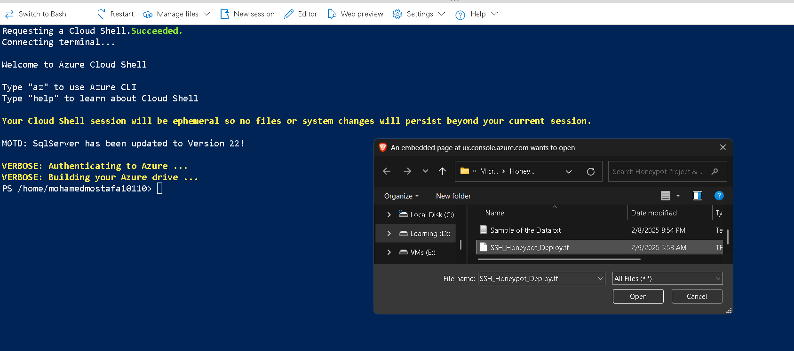
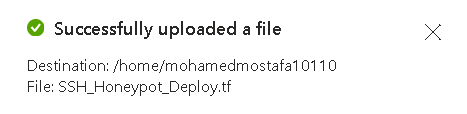
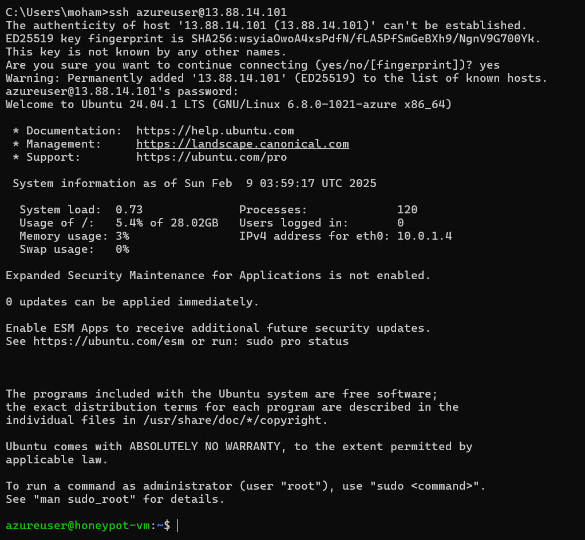

# SSH Honeypot Deployment with Terraform on Azure

This project deploys an SSH Honeypot on Microsoft Azure using Terraform. The honeypot is configured to log unauthorized access attempts and integrates with [AbuseIPDB_pshitt](https://github.com/MohamedMostafa010/AbuseIPDB_pshitt.git) for passive SSH attack detection. Additionally, it reports suspicious IP addresses to [AbuseIPDB](https://www.abuseipdb.com/) for threat intelligence sharing.

## Overview

We use Terraform to automate the deployment of an Ubuntu-based virtual machine acting as an SSH honeypot. The infrastructure includes:

- A **Virtual Network** and **Subnet**
- A **Public IP Address** assigned to the honeypot
- A **Network Security Group (NSG)** allowing SSH, HTTP, and HTTPS traffic
- A **Virtual Machine (VM)** running Ubuntu 24.04 LTS
- Integration with **pshitt** and **AbuseIPDB** to analyze and report malicious activity

## Modifications & Enhancements  

- We have improved the original **pshitt** SSH honeypot by integrating it with **AbuseIPDB**, allowing real-time threat intelligence reporting. These enhancements provide:  
   - **Automatic reporting** of malicious SSH attempts to [AbuseIPDB](https://www.abuseipdb.com/)  
   - **Better logging** of captured credentials, attack sources, and metadata  
   - **Improved compatibility** with modern Python versions and security modules  
   - **Forked & enhanced version:** [AbuseIPDB_pshitt](https://github.com/MohamedMostafa010/AbuseIPDB_pshitt.git)  

- This forked version of `pshitt` ensures a more **efficient, real-time, and scalable** way to track SSH attacks, making it an excellent tool for honeypot monitoring.  

## Terraform Configuration

The infrastructure is defined in `SSH_Honeypot_Deploy.tf`. Below is an overview of key Terraform resources:

- **Virtual Network & Subnet:** Creates an isolated environment for the honeypot.
- **Public IP & NSG Rules:** Allows SSH (port 22), HTTP (port 80), and HTTPS (port 443) traffic.
- **Virtual Machine:** Deploys an Ubuntu 24.04 LTS VM with password authentication enabled.

## Deployment Steps

1. **Install Terraform**  
   Download and install Terraform from [Terraform's official site](https://developer.hashicorp.com/terraform/downloads).

2. **Clone the Repository**  
   ```sh
   git clone https://github.com/MohamedMostafa010/SSH_Honeypot_Project_Pshitt.git
   cd SSH_Honeypot_Project_Pshitt
   ```

3. **Upload Terraform File**
   
   
   
   
5. **Initialize Terraform**
   ```sh
   terraform init
   ```

6. **Plan Deployment**
   ```sh
   terraform plan
   ```

7. **Deploy Infrastructure (Until the below green message displayed)**
   ```sh
   terraform apply -auto-approve
   ```
   

- Honeypot Virtual Machine Deployed, let's Setup the Honeypot Tool on it.
  
## AbuseIPDB Installation and Setup

1. **Access the Honeypot**
   ```sh
   ssh azureuser@<public-ip>
   ```
   

2. **Ensure Dependencies are Installed**
   ```sh
   sudo apt-get update -y
   sudo apt-get install -y git python3 python3-pip python3-dev libssl-dev libffi-dev build-essential python3-venv python3-daemon python3-pycryptodome python3-paramiko python3-zope.interface
   ```

3. **Disable SSH Entirely (Optional, but better if you want a dedicated SSH Honeypot Server)**
   ```sh
   sudo systemctl disable ssh.socket
   sudo systemctl stop ssh.socket
   sudo systemctl disable ssh
   sudo systemctl stop ssh
   ```

4. **Clone the New Integrated Pshitt (AbuseIPDB_pshitt)**
   ```sh
   git clone --verbose https://github.com/MohamedMostafa010/AbuseIPDB_pshitt.git
   cd AbuseIPDB_pshitt
   ```

5. **Run this SSH Honeypot Tool (You can change the port, also the File Name and Path)**
   ```sh
   chmod +x pshitt.py
   sudo ./pshitt.py -p 22 -o /home/azureuser/credentials.json
   ```
- Now the Honeypot Tool "AbuseIPDB_pshitt" is Listening on Port 22 (Acting as it is a real SSH Server)

## Sample of Data when Executing

1. **Remove the Old SSH Host Key Entry from the **known_hosts file****
   ```sh
   C:\Users\moham>ssh 13.88.14.101
   @@@@@@@@@@@@@@@@@@@@@@@@@@@@@@@@@@@@@@@@@@@@@@@@@@@@@@@@@@@
   @    WARNING: REMOTE HOST IDENTIFICATION HAS CHANGED!     @
   @@@@@@@@@@@@@@@@@@@@@@@@@@@@@@@@@@@@@@@@@@@@@@@@@@@@@@@@@@@
   IT IS POSSIBLE THAT SOMEONE IS DOING SOMETHING NASTY!
   Someone could be eavesdropping on you right now (man-in-the-middle attack)!
   It is also possible that a host key has just been changed.
   The fingerprint for the RSA key sent by the remote host is
   SHA256:OhNL391d/beeFnxxg18AwWVYTAHww+D4djEE7Co0Yng.
   Please contact your system administrator.
   Add correct host key in C:\\Users\\moham/.ssh/known_hosts to get rid of this message.
   Offending ECDSA key in C:\\Users\\moham/.ssh/known_hosts:21
   Host key for 13.88.14.101 has changed and you have requested strict checking.
   Host key verification failed.
   
   C:\Users\moham>ssh-keygen -R 13.88.14.101
   # Host 13.88.14.101 found: line 19
   # Host 13.88.14.101 found: line 20
   # Host 13.88.14.101 found: line 21
   C:\Users\moham/.ssh/known_hosts updated.
   Original contents retained as C:\Users\moham/.ssh/known_hosts.old
   ```
- When you deploy a honeypot (like Pshitt in your case), it disables the real SSH service and generates a new SSH host key for the fake SSH server. This is why the SSH client on your local machine detects a host key change and warns you about a potential security risk.

2. **Trying Login Attempts**
   ```sh
   C:\Users\moham>ssh 13.88.14.101
   The authenticity of host '13.88.14.101 (13.88.14.101)' can't be established.
   RSA key fingerprint is SHA256:OhNL391d/beeFnxxg18AwWVYTAHww+D4djEE7Co0Yng.
   This host key is known by the following other names/addresses:
       C:\Users\moham/.ssh/known_hosts:9: 192.168.219.128
       C:\Users\moham/.ssh/known_hosts:10: 13.93.216.131
       C:\Users\moham/.ssh/known_hosts:11: 13.64.65.74
       C:\Users\moham/.ssh/known_hosts:12: 13.64.210.160
       C:\Users\moham/.ssh/known_hosts:15: 138.91.158.207
       C:\Users\moham/.ssh/known_hosts:16: 138.91.154.112
       C:\Users\moham/.ssh/known_hosts:17: 13.73.54.181
       C:\Users\moham/.ssh/known_hosts:18: 13.88.14.101
   Are you sure you want to continue connecting (yes/no/[fingerprint])? yes
   Warning: Permanently added '13.88.14.101' (RSA) to the list of known hosts.
   moham@13.88.14.101's password:
   Permission denied, please try again.
   moham@13.88.14.101's password:
   Permission denied, please try again.
   moham@13.88.14.101's password:
   moham@13.88.14.101: Permission denied (password,publickey).
   ```
   
3. **Captured Credentials/Information (Image and Text have the same data)**
   
   ```sh
   {"username": "user", "password": "CoMpLeEx!", "src_ip": "156.214.155.185", "src_port": 64641, "timestamp": "2025-02-09T04:04:42.519138", "software_version": "OpenSSH_for_Windows_9.5", "cipher": "aes128-ctr", "mac": "hmac-sha2-256-etm@openssh.com", "try": 1, "abuseipdb": {"ipAddress": "156.214.155.185", "isPublic": true, "ipVersion": 4, "isWhitelisted": null, "abuseConfidenceScore": 0, "countryCode": "EG", "usageType": "Fixed Line ISP", "isp": "TE Data", "domain": "tedata.net", "hostnames": ["host-156.214.185.155-static.tedata.net"], "isTor": false, "totalReports": 0, "numDistinctUsers": 0, "lastReportedAt": null}}
   {"username": "user", "password": "WrOnGpAsS", "src_ip": "156.214.155.185", "src_port": 64641, "timestamp": "2025-02-09T04:04:49.241704", "software_version": "OpenSSH_for_Windows_9.5", "cipher": "aes128-ctr", "mac": "hmac-sha2-256-etm@openssh.com", "try": 2, "abuseipdb": {"ipAddress": "156.214.155.185", "isPublic": true, "ipVersion": 4, "isWhitelisted": null, "abuseConfidenceScore": 0, "countryCode": "EG", "usageType": "Fixed Line ISP", "isp": "TE Data", "domain": "tedata.net", "hostnames": ["host-156.214.185.155-static.tedata.net"], "isTor": false, "totalReports": 0, "numDistinctUsers": 0, "lastReportedAt": null}}
   {"username": "user", "password": "It_Is_A_Honeypot$$", "src_ip": "156.214.155.185", "src_port": 64641, "timestamp": "2025-02-09T04:05:07.210905", "software_version": "OpenSSH_for_Windows_9.5", "cipher": "aes128-ctr", "mac": "hmac-sha2-256-etm@openssh.com", "try": 3, "abuseipdb": {"ipAddress": "156.214.155.185", "isPublic": true, "ipVersion": 4, "isWhitelisted": null, "abuseConfidenceScore": 0, "countryCode": "EG", "usageType": "Fixed Line ISP", "isp": "TE Data", "domain": "tedata.net", "hostnames": ["host-156.214.185.155-static.tedata.net"], "isTor": false, "totalReports": 0, "numDistinctUsers": 0, "lastReportedAt": null}}
   ```
- The honeypot logs crucial attack data, including source IPs, usernames, passwords, encryption methods, and software versions. This information can help in:

   - **Threat Intelligence:** Identifying attack patterns and malicious IPs.
   - **Incident Response:** Enriching security logs and responding to threats proactively.
   - **Security Research:** Studying brute-force techniques and attacker behavior.
   - **IP Reputation Analysis:** Reporting malicious IPs to services like AbuseIPDB to improve global cybersecurity.

## **Accessing the Honeypot After Disabling SSH**  

- Since SSH has been **completely disabled** on the honeypot to act solely as a decoy, **remote access** is only possible through Azure's **Serial Console**.  

- #### **What is the Serial Console?**  
   - The Azure Serial Console provides direct access to the virtual machine's **serial port**, allowing you to manage and troubleshoot the system **without requiring SSH access**. This is useful for debugging, configuring services, and recovering access to the system.  

- #### **To use the Serial Console, you must first enable Boot Diagnostics:**  

1. **Go to the Azure Portal**  
2. Navigate to your **Virtual Machine**  
3. Click on **Boot Diagnostics** (under Support + Troubleshooting)  
4. Click **Enable** and ensure a **Storage Account** is selected  
5. Save the settings
   
   

- Once Boot Diagnostics is enabled, you can:  
   - Open the **Serial Console** from the VM's Overview page in Azure  
   - Interact with the system as if you were physically connected to the machine  

- This method ensures that even with **SSH disabled**, you still have a way to access and manage the honeypot. 🚀

## **Limitations and Constraints**

- Due to an issue verifying my **Egyptian phone number**, I couldn't create a standard Azure account. As a result, I had to use the **Microsoft Azure Learn Sandbox**, which comes with certain limitations, such as restricted resource availability and temporary environments that auto-expire.

## **Sample of Possible Errors and Solutions**

- **Error: 403 Forbidden - RequestDisallowedByPolicy**
  ```sh
   │ Error: creating Network Interface (Subscription: "4b5eb158-8ae8-49e2-aad4-93c5d851be75"
   │ Resource Group Name: "learn-ff5d90b3-04aa-428d-b669-a4c715a2346b"
   │ Network Interface Name: "honeypot-nic"): performing CreateOrUpdate: unexpected status 403 (403 Forbidden) with error:
   │ RequestDisallowedByPolicy: Resource 'honeypot-nic' was disallowed by policy.
  ```
   - Azure Policy is restricting the creation of specific resources in the subscription.
   - If you are using an Azure Sandbox, deactivate the current one and activate a new sandbox. This will give you a different Subscription ID with different policies. Most probable the issue exists in the subscription policies enforced.
- **Error: Error obtaining Authorization Token**
  
   ```sh
   │ Error: Error obtaining Authorization Token: Error: NoCredentialProviders: no valid providers in chain.
   ``` 
   - Terraform cannot authenticate with Azure due to missing credentials.
   - **Ensure Azure CLI is Logged In:**
  
     ```sh
     az login
     ```
   - **Set the Subscription ID (if multiple accounts are present):**

     ```sh
     az account set --subscription "YOUR_SUBSCRIPTION_ID"
     ```
- **Error: A resource with the ID already exists**

  ```sh
  │ Error: A resource with the ID already exists - to be managed via Terraform this resource needs to be imported into the State.
  ```
   - Terraform is trying to create a resource that already exists in Azure.
   - **Import the Existing Resource into Terraform State:**
  
     ```sh
     terraform import azurerm_resource_group.example /subscriptions/YOUR_SUBSCRIPTION_ID/resourceGroups/my-rg
     ```
   - **If the Resource Should Not Exist, Manually Delete It:**

      ```sh
     az resource delete --ids /subscriptions/YOUR_SUBSCRIPTION_ID/resourceGroups/my-rg
     ```
- **Python Errors**
  - Ensure **Dependencies** are Installed.
     
## **Contributing**

- Contributions are welcome! If you have suggestions or improvements, feel free to open a pull request or issue on the repository.

## **License**

- This project is released under the **MIT License**.

